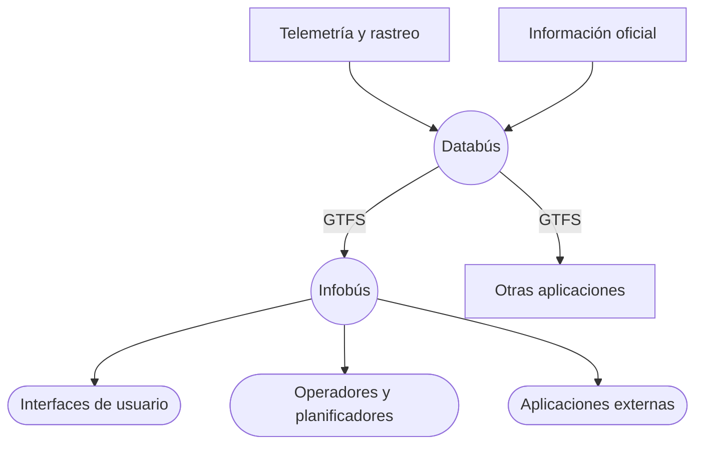

Tecnología y comunicación para los sistemas de información del transporte público

Enero 2026

---
layout: section
---

# quiénes somos

---

## nosotros

::definition
El Laboratorio de Sistemas Inteligentes de Movilidad (SIMOVI) de la Escuela de Ingeniería Eléctrica (EIE) de la Universidad de Costa Rica (UCR) realiza investigación y desarrollo en sistemas inteligentes de transporte público.
::

<strong>Fabián Abarca Calderón, M.Sc.</strong> 
<em>Coordinador y desarrollador principal</em>

<strong>Marvin Coto Jiménez, Ph.D.</strong> 
<em>Análisis de datos e inteligencia artificial</em>

<strong>Gustavo Núñez Segura, Ph.D.</strong> 
<em>Redes de telecomunicaciones</em>

<strong>Jonathan Agüero Valverde, Ph.D.</strong> 
<em>Transporte y estadística espacial</em>

<strong>Silvia Mata Marín, Ph.D.</strong> 
<em>Diseño de servicios y diseño gráfico</em>

<strong>Fabiana Gama de Medeiros, Ph.D.</strong> 
<em>Estudios de comportamiento y percepción</em>

---
layout: section
---

# plan piloto ucr

---

SIMOVI desarrollará el plan piloto de un sistema de información del transporte público para el servicio de bus interno del campus central de la Universidad de Costa Rica.

Primer sistema inteligente de transporte público del país.

Permitirá evaluación de la arquitectura tecnológica.

Permitirá evaluación de la estrategia de comunicación.

Implementación en un ambiente de aplicación real.

Desarrollo propio en la infraestructura de la UCR.

Lanzamiento previsto para agosto de 2026.

---
layout: section
---

# infotp

---

## resumen

::definition
**InfoTP** es el resultado de la investigación en tecnologías y estándares aplicados al transporte público inteligente, el diseño de sistemas de ingeniería y el diseño de servicios, presentado como una guía práctica de diseño e implementación.
::

Más de veinte proyectos de código abierto.

Diseño con subsistemas e interfaces bien delimitados.

Tecnologías robustas usadas en entornos críticos.

Base para un ecosistema digital abierto.

Compatible con las ciudades inteligentes.

Respaldo académico e institucional de la UCR.

Informe completo disponible en marzo 2026.

---

## visión

::definition
Construimos nuestra propuesta con base en las recomendaciones de las organizaciones internacionales líderes en sistemas inteligentes de transporte público y sistemas de software. **InfoTP** es una arquitectura tecnológica y una estrategia de comunicación basadas en un principio esencial: **unicidad de la información**.
::

Este **diseño conjunto** de tecnología y comunicación permite ofrecer información **consistente**, **precisa**, **actualizada** y desde una **fuente única**, a través de la mayor cantidad posible de canales de comunicación.

    

        
Datos abiertos y estandarizados

    

    

        
Arquitectura única para el sistema

    

    

        
Interoperabilidad

    

    

        
Independencia tecnológica

    

---
layout: section
---

# tecnología

---

## gtfs

::definition
Somos los especialistas de **GTFS** en Costa Rica. Todo el diseño de **InfoTP** gira alrededor de esta especificación y otros estándares complementarios.
::

Tenemos más de 5 años de experiencia con <strong>GTFS</strong> <i>Schedule</i> y <strong>GTFS</strong> <i>Realtime</i> en sitios web y Google Maps.

Somos miembros académicos de <strong>MobilityData</strong>, la organización internacional que dirige su evolución.

Desarrollamos herramientas informáticas especializadas para su procesamiento y análisis.

 

---

## arquitectura

::definition
La **arquitectura tecnológica** de **InfoTP** es una **solución de extremo a extremo** para los sistemas de información del transporte público. Su arquitectura tiene dos subsistemas principales.
::

### Databús

*Subsistema* :badge{ value="A1" color="#6DC067" }

Recopila la información oficial y los datos de rastreo y telemetría de los vehículos para la publicación en tiempo real con la especificación **GTFS**, disponible para todas las aplicaciones compatibles, incluyendo Google Maps, Moovit, Transit y otros proveedores.

### Infobús

*Subsistema* :badge{ value="A2" color="#F37021" }

Consume datos **GTFS** y distribuye la información por múltiples canales, interfaces y protocolos para todas las partes del sistema, incluyendo las personas usuarias, operadores, planificadores, reguladores, investigadores y otros proveedores tecnológicos.

Databús® e Infobús® son marcas registradas de la Universidad de Costa Rica.

---

## diagrama básico

---

    
    

        

            <material-symbols-location-on class="text-4xl mb-3" />
            
Recolección de datos de rastreo y telemetría de los vehículos e información oficial de agencias.

        

        

            <material-symbols-bolt class="text-4xl mb-3" />
            
Procesamiento y análisis de datos de alta frecuencia en tiempo real.

            

        

            <material-symbols-feed class="text-4xl mb-3" />
            
Publicación de <em>feeds</em> (suministros de datos) de <strong>GTFS</strong> <em>Schedule</em> y <strong>GTFS</strong> <em>Realtime</em>.

        

    

---

<material-symbols-feed class="text-4xl mb-3" />

Recolección de <em>feeds</em> (suministros de datos) de <strong>GTFS</strong> de diferentes sistemas de transporte.

<material-symbols-database class="text-4xl mb-3" />

Almacenamiento de datos históricos en bases de datos especializadas.

<material-symbols-analytics class="text-4xl mb-3" />

Análisis de datos para optimización, investigación o regulación del servicio.

<material-symbols-send class="text-4xl mb-3" />

Distribución de la información vía múltiples canales, interfaces y protocolos.

---

## ecosistema tecnológico

::definition
**InfoTP** está orientado hacia la **interoperabilidad** y la **independencia tecnológica**, fomentando un ecosistema de innovación con una variedad de opciones para todas las partes interesadas.
::

<h4 class="font-bold mb-3">Databús</h4>

Habilita la participación de proveedores tecnológicos compatibles directamente con GTFS.

<dl class="text-sm space-y-3">
<dt class="font-semibold"><material-symbols-open-in-phone-rounded/> Aplicaciones de planificación de viajes multimodales</dt>
<dd class="ml-4 text-xs">Google Maps, Transit, etc.</dd>
<dt class="font-semibold"><material-symbols-settings/> Servicios de gestión y optimización operativa</dt>
<dd class="ml-4 text-xs">Optibus, UbiRider, Moovit MaaS, etc.</dd>
<dt class="font-semibold"><material-symbols-edit/> Editores de GTFS</dt>
<dd class="ml-4 text-xs">Ualabee, AddTransit, etc.</dd>
</dl>

<h4 class="font-bold mb-3">Infobús</h4>

Habilita la participación de proveedores tecnológicos gracias a una multitud de interfaces para aplicaciones independientes.

<dl class="text-sm space-y-3">
<dt class="font-semibold"><material-symbols-web/> Páginas web externas</dt>
<dd class="ml-4 text-xs">Conexión con datos estáticos y en tiempo real</dd>
<dt class="font-semibold"><material-symbols-signpost/> Publicidad exterior</dt>
<dd class="ml-4 text-xs">JCDecaux, Colorvisión, Publiex, etc.</dd>
<dt class="font-semibold"><material-symbols-person-play/> Aficionados a la tecnología</dt>
<dd class="ml-4 text-xs">Desarrollos independientes y experimentales</dd>
</dl>

---

## arquitectura complementaria

::definition
La **arquitectura tecnológica** de **InfoTP** incluye dos subsistemas complementarios para facilitar y robustecer su operación.
::

### Infobús Admin

*Subsistema* :badge{ value="A3" color="#FFDD00" }

Ofrece una interfaz con el **sector administrativo** para gestionar todos los datos relacionados con el sistema de información.

### Databús Admin

*Subsistema* :badge{ value="A4" color="#7B3400" }

Ofrece herramientas para el personal de **tecnologías de información** para monitorear la calidad y la seguridad de la infraestructura digital.

---

<material-symbols-edit class="text-4xl mb-3" />

Interfaz web para la edición de <strong>GTFS</strong> <em>Schedule</em>.

<material-symbols-verified class="text-4xl mb-3" />

Validación de datos y estimación de tiempos de llegada.

<material-symbols-query-stats class="text-4xl mb-3" />

Análisis de métricas de desempeño del servicio.

<material-symbols-dashboard-customize class="text-4xl mb-3" />

Gestión de contenidos de los canales de comunicación.

<material-symbols-science class="text-4xl mb-3" />

Simulación de datos de transporte para pruebas.

<material-symbols-draw class="text-4xl mb-3" />

Rotulación automatizada con los datos y los diseños oficiales.

---

<material-symbols-monitor-heart class="text-4xl" />

Monitoreo del desempeño de la infraestructura digital del sistema.

<material-symbols-shield-lock class="text-4xl" />

Atención de amenazas de seguridad y medidas de contingencia contra ataques.

<simple-icons-python class="text-4xl" />

Herramientas para Python, usado en la orquestación de procesos, análisis de datos e inteligencia artificial.

<simple-icons-typescript class="text-4xl" />

Herramientas para TypeScript, usado en interfaces web y aplicaciones móviles.

<simple-icons-rust class="text-4xl" />

Herramientas para Rust, usado en procesos críticos de alto desempeño para procesamiento en tiempo real.

---

## tecnologías

::definition
Utilizamos una cuidadosa selección de tecnologías robustas de código abierto.
::

    

    <simple-icons-django class="text-2xl"/>
    Django
    

    

    <simple-icons-postgresql class="text-2xl"/>
    PostgreSQL
    

    

    <simple-icons-redis class="text-2xl"/>
    Redis
    

    

    <simple-icons-prefect class="text-2xl"/>
    Prefect
    

    

    <simple-icons-rabbitmq class="text-2xl"/>
    RabbitMQ
    

    

    <simple-icons-timescale class="text-2xl"/>
    TimescaleDB
    

    

    <simple-icons-mongodb class="text-2xl"/>
    MongoDB
    

    

    <simple-icons-graphql class="text-2xl"/>
    Strawberry
    

    

    <simple-icons-celery class="text-2xl"/>
    Celery
    

    

    <simple-icons-apache class="text-2xl"/>
    Fuseki
    

    

    <simple-icons-modelcontextprotocol class="text-2xl"/>
    FastMCP
    

    

    <simple-icons-strapi class="text-2xl"/>
    Strapi
    

    

    <simple-icons-vuedotjs class="text-2xl"/>
    Vue
    

    

    <simple-icons-nuxtdotjs class="text-2xl"/>
    Nuxt
    

    

    <simple-icons-capacitor class="text-2xl"/>
    Capacitor
    

    

    <simple-icons-ionic class="text-2xl"/>
    Ionic
    

    

    <simple-icons-grafana class="text-2xl"/>
    Grafana
    

    

    <simple-icons-prometheus class="text-2xl"/>
    Prometheus
    

    

    <simple-icons-docker class="text-2xl"/>
    Docker
    

    

    <simple-icons-opentelemetry class="text-2xl"/>
    OpenTelemetry
    

    

    <simple-icons-polars class="text-2xl"/>
    Polars
    

    

    <simple-icons-apacheparquet class="text-2xl"/>
    Parquet
    

    

    <mdi-lock class="text-2xl"/>
    Wazuh
    

    

    <mdi-magnify-scan class="text-2xl"/>
    Zabbix
    

---
layout: section
---

# comunicación

---

## estrategia

::definition
La **estrategia de comunicación** de **InfoTP** es una visión integral que promueve el uso del transporte público y ayuda a mejorar la satisfacción de las personas usuarias con el servicio. La comunicación está enfocada en diversos canales.

::

<material-symbols-devices class="text-4xl" />
Medios digitales

<material-symbols-map class="text-4xl" />
Medios impresos

<material-symbols-signpost class="text-4xl" />
Señalética

<material-symbols-share class="text-4xl" />
Redes sociales

<material-symbols-circle-notifications class="text-4xl" />
Notificaciones

<material-symbols-support-agent class="text-4xl" />
Atención al cliente

---

## diseño nativo

 

<h5 class="font-bold mb-2"><material-symbols-devices/> Nativo digital</h5>

Todos los canales digitales son parte de la oferta de información.

<h5 class="font-bold mb-2"><material-symbols-mobile-rotate-sharp/> Nativo móvil</h5>

Diseño orientado a los dispositivos personales.

<h5 class="font-bold mb-2"><material-symbols-accessibility-new/> Nativo inclusivo</h5>

Información oportuna y con diseño universal.

<h5 class="font-bold mb-2"><material-symbols-lightbulb/> Nativo inteligente</h5>

Nuevas interfaces de lenguaje natural para hacer consultas.

<h5 class="font-bold mb-2"><material-symbols-share/> Nativo social</h5>

Información y comunidad alrededor del transporte público.

<h5 class="font-bold mb-2"><material-symbols-emoji-language/> Nativo multilingüe</h5>

Sin barreras de lenguaje para personas de todo el mundo.

<h5 class="font-bold mb-2"><material-symbols-flag/> Nativo tico</h5>

Es parte de nuestros pueblos y ciudades, por eso el transporte público debe ser un orgullo tico.

---

## puntos de contacto

::definition
En el diseño de servicios, los "puntos de contacto" son los lugares donde las personas usuarias interactúan con el sistema. **InfoTP** busca crear o habilitar todas las opciones posibles, desarrolladas localmente u ofrecidas por terceros, aprovechando la infraestructura de **Databús** e **Infobús**.
::

<material-symbols-language class="text-4xl mb-3" />

Páginas web

<material-symbols-smartphone class="text-4xl mb-3" />

Aplicaciones móviles

<material-symbols-ambient-screen class="text-4xl mb-3" />

Pantallas externas

<material-symbols-route class="text-4xl mb-3" />

Planificación de viajes

<material-symbols-search class="text-4xl mb-3" />

Búsquedas con lenguaje natural

<material-symbols-exposure-plus-1 class="text-4xl mb-3" />

Otros puntos de contacto

---

## catálogos

::definition
La investigación de **InfoTP** resultó en 17 catálogos divididos en 6 dominios que hacen un recuento exhaustivo de los componentes relevantes del sistema de información del transporte público.
::

<material-symbols-foundation class="text-4xl mb-2" />

Fundamentos

<ul class="text-sm text-left">
<li>Principios</li>
<li>Aplicaciones</li>
<li>Requisitos</li>
</ul>

<material-symbols-domain class="text-4xl mb-2" />

Institucional

<ul class="text-sm text-left">
<li>Partes</li>
<li>Actores</li>
<li>Organizaciones</li>
</ul>

<material-symbols-database class="text-4xl mb-2" />

Datos

<ul class="text-sm text-left">
<li>Entidades</li>
<li>Componentes</li>
</ul>

<material-symbols-settings class="text-4xl mb-2" />

Tecnología

<ul class="text-sm text-left">
<li>Tecnologías</li>
<li>Estándares</li>
<li>Interfaces</li>
</ul>

<material-symbols-campaign class="text-4xl mb-2" />

Comunicación

<ul class="text-sm text-left">
<li>Marcas</li>
<li>Gráficos</li>
<li>Señalización</li>
<li>Interfaces</li>
</ul>

<material-symbols-directions-bus class="text-4xl mb-2" />

Servicio

<ul class="text-sm text-left">
<li>Espacios</li>
<li>Tiempos</li>
</ul>

Catálogos disponibles en marzo 2026.

---
layout: section
---

# trabajo conjunto

---

## ventajas

 

<h5 class="font-bold mb-2"><mdi-target-variant /> Especialización</h5>

Propuesta basada en normas, especificaciones y estándares internacionales.

<h5 class="font-bold mb-2"><mdi-sync /> Consistencia y unicidad</h5>

La información es <strong>consistente</strong> entre sí y con los datos oficiales a partir de una <strong>fuente única</strong>.

<h5 class="font-bold mb-2"><mdi-network /> Gestión integral de la comunicación</h5>

Manejo unificado de todos los puntos de contacto con el sistema.

<h5 class="font-bold mb-2"><mdi-puzzle /> Flexibilidad de implementación</h5>

Permite la <strong>coexistencia con otros servicios</strong> y proveedores del mercado.

<h5 class="font-bold mb-2"><mdi-stairs /> Implementación gradual</h5>

El <strong>diseño modular</strong> permite la adición paulatina de nuevas funcionalidades.

<h5 class="font-bold mb-2"><mdi-toolbox /> Soluciones a la medida</h5>

En coordinación con las autoridades, el sistema puede satisfacer <strong>demandas específicas</strong>.

---

## ventajas

 

<h5 class="font-bold mb-2"><mdi-shield-lock /> Seguridad y robustez</h5>

El sistema tiene un diseño orientado a la <strong>seguridad de los datos y la confiabilidad</strong>.

<h5 class="font-bold mb-2"><mdi-school /> Respaldo académico</h5>

Propuesta de la Escuela de Ingeniería Eléctrica UCR en alianza con otras <strong>instancias especializadas</strong>.

<h5 class="font-bold mb-2"><mdi-file /> Garantía contractual</h5>

Servicios brindados mediante un contrato con la Universidad de Costa Rica.

<h5 class="font-bold mb-2"><mdi-cash-multiple /> Flexibilidad de financiamiento</h5>

La arquitectura modular permite el financiamiento de <strong>distintas fuentes</strong>.

<h5 class="font-bold mb-2"><mdi-hand-coin /> Monetización del sistema</h5>

Varias opciones de <strong>monetización del sistema</strong> que ayudan a financiar los servicios.

<h5 class="font-bold mb-2"><mdi-github /> Código abierto</h5>

Uso en la comunidad nacional e internacional por medio de proyectos de código abierto.

---

## contacto

<strong>Laboratorio de Sistemas Inteligentes de Movilidad</strong> 
Escuela de Ingeniería Eléctrica 
Facultad de Ingeniería 
Universidad de Costa Rica 
<a url="mailto:simovi@ucr.ac.cr" target=_blank>simovi@ucr.ac.cr</a>

<strong>Fabián Abarca Calderón</strong> 
Coordinador 
<a url="mailto:fabian.abarca@ucr.ac.cr" target=_blank>fabian.abarca@ucr.ac.cr</a> 

---
layout: quote
---

<AnimatedLogo />